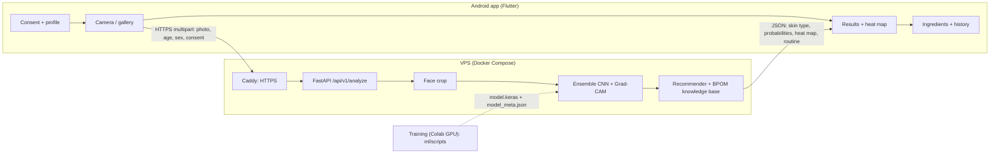

# Glowrithm

Skincare ingredient recommendations from facial skin-type classification (Capstone Design,
S1 Teknik Telekomunikasi, Telkom University). A photo of the user's face is classified as
**dry, normal or oily** by an ensemble CNN (ResNet50V2 + EfficientNetB0, feature concatenation),
explained with a **Grad-CAM** heat map, and mapped to a cleanse / treat / protect routine of
active ingredients filtered by their **BPOM** regulatory status.



## Repository layout

| Folder | What it contains |
|---|---|
| `ml/` | Python package `glowrithm_ml` (preprocessing, data pipeline, model, Grad-CAM, metrics) and scripts to prepare data, train, evaluate, test robustness, export TFLite, benchmark |
| `backend/` | FastAPI service, ingredient knowledge base, tests, Dockerfile |
| `deploy/` | Docker Compose + Caddy (automatic HTTPS) for the VPS |
| `mobile/` | Flutter app (Android) |
| `web/` | Web test build of the app, served by the backend at `/app/` (see `web/README.md`) |
| `tests/web_e2e/` | End-to-end browser test of the web app (headless Chromium, fake camera) |
| `docs/IMPLEMENTATION_GUIDE.md` | Step-by-step plan to finish implementation and testing (start here) |
| `docs/PANDUAN_UJI_WEB_APP.md` | How to run and test the web app (Indonesian) |

## Quick start: see the whole system in 5 minutes (demo model, no training needed)

```bash
# 1. API with an untrained demo model (results are random, but every screen works)
cd backend
python -m venv .venv && source .venv/bin/activate      # Windows: .venv\Scripts\activate
pip install tensorflow-cpu -r requirements.txt          # macOS: pip install tensorflow -r requirements.txt
pip install -e ../ml
GLOWRITHM_DEMO_MODE=1 uvicorn app.main:app --host 0.0.0.0 --port 8000
# open http://localhost:8000/app/ (web test build of the app) and http://localhost:8000/docs (API)

# 2. Android app (in another terminal, Flutter SDK + Android emulator or phone)
cd mobile
flutter create --org id.glowrithm --platforms android .
python tool/patch_android.py
flutter pub get
flutter run --dart-define=API_BASE_URL=http://10.0.2.2:8000   # phone on Wi-Fi: http://<laptop-LAN-IP>:8000
```

Then follow `docs/IMPLEMENTATION_GUIDE.md` to train the real model and replace the demo.
